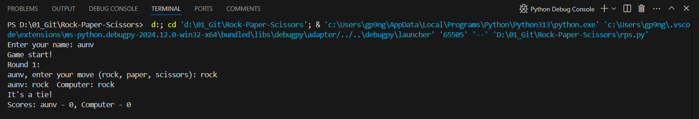

# Rock-Paper-Scissors

## Project Overview

This project is a command-line implementation of the classic game Rock, Paper, Scissors. It allows a human player to compete against a computer opponent using different strategies. The game keeps track of scores and logs the results to a file.

### About the game
The game of Rock Paper Scissors is played throughout the world. It dates back to the Han Dynasty of ancient China, contemporary with the Roman Empire. Today it is called jian dao, shi tou, bu in China, pierre-papier-ciseaux or chifoumi in France; roshambo in parts of the U.S., taş kağıt makas in Turkey, and jan-ken-pon in Japan. It is the distant ancestor of the type system in the immensely popular Pokémon games. The game is played competitively; there have been international RPS tournaments — however, it's more commonly used as a playful way of settling disputes, whether in the schoolyard or the barroom.

The game has two players. In a single round of the game, each player secretly chooses one of three moves, or "throws" — rock, paper, or scissors. Then, players reveal their moves at the same time. If both players picked the same move, there is no winner. Otherwise, rock beats scissors; paper beats rock; and scissors beat paper. Players can play a single round, or "best of three", or any number of other options.

### Features:
- Play against a computer with various strategies.
- Score tracking for each round.
- Game results logged in a file with a timestamp.
- Input validation for user moves.

 <!-- Replace with your image path -->

---

## Project Guideline

To run the game, ensure you have Python 3 installed on your machine. Follow the steps below to execute the program:

1. Clone the repository or download the code files.
2. Navigate to the directory containing the `rps.py` file.
3. Run the game using the command:
   ```bash
   python3 rps.py


### Game Mechanics

#### Winning Conditions:
- **Rock** beats **Scissors**: If a player chooses rock and the opponent chooses scissors, the player wins.
- **Scissors** beats **Paper**: If a player chooses scissors and the opponent chooses paper, the player wins.
- **Paper** beats **Rock**: If a player chooses paper and the opponent chooses rock, the player wins.

#### Computer Strategies:
- **Rock Player**: Always chooses Rock. This player has a fixed strategy and will never change their move.
  
- **Random Player**: Chooses moves randomly from the available options (rock, paper, or scissors). This player adds unpredictability to the game.
  
- **Reflect Player**: Mimics the opponent's last move. If the human player chose rock in the previous round, the Reflect Player will choose rock in the next round.
  
- **Cycle Player**: Cycles through the three moves in order: Rock, Paper, Scissors. After choosing scissors, it will revert back to rock in the next round.

#### Example Game Flow:
1. The human player enters their move.
2. The computer player uses one of its strategies to make a move.
3. The winner is determined based on the winning conditions.
4. Scores are updated and displayed.
5. The round result is logged for future reference.

## Project Result
After completing a set number of rounds (default is 3), the game will display the final scores for both the human player and the computer. The results are also saved in a log file named in the format `yyyMMddHHmmss-game.log`.

## Project rubric
# Project Checklist

## Gameplay
- [x] The program plays a game of Rock Paper Scissors, following the conventional rules.
- [x] Paper beats rock; rock beats scissors; scissors beat paper.
- [x] The program plays a match consisting of multiple rounds, and tracks players' total score.
- [x] The game displays the results after each round, including each player's score.
- [x] The final score is displayed at the end of the game.
- [x] There are at least four different computer player classes, each implementing a different strategy.
- [x] The following computer player strategies are implemented:
  - [x] A player that always plays 'rock'.
  - [x] A player that chooses its moves randomly.
  - [x] A player that remembers and imitates what the human player did in the previous round.
  - [x] A player that cycles through the three moves.
- [x] Each player class has a method that returns that player's move.
- [x] Each player class has a method for remembering information about the round.
- [x] The game calls each player's move method once in each round.
- [x] The game calls the remembering method after each round to inform players of the opponent's move.

## Object-Oriented Programming
- [x] The code uses classes and objects to store game data, rather than global variables.
- [x] The `Game` class includes a method to play a single round.
- [x] The `Game` class includes a method to play a match of several rounds.
- [x] Facts about the current match (e.g., players' scores) are stored as instance variables.
- [x] Each computer player strategy is a subclass of the `Player` base class.
- [x] The human player is implemented as a subclass of the `Player` base class.

## Code Style
- [x] The code style follows the standard Python style guide (PEP 8).
- [x] The `pycodestyle` tool reports zero errors and zero warnings.
- [x] The program does not crash or display error messages.
- [x] The code is thoroughly tested.
- [x] Invalid moves do not make the program crash.
- [x] The program checks the validity of user input.
- [x] The game prompts the user to retry invalid moves until they enter a valid one.

